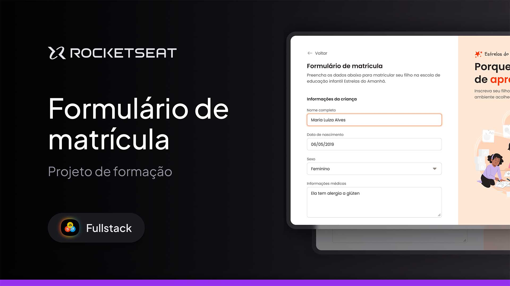

<h1 align="center"> Registration form </h1>

Visual design of a form for a desktop website. This form simulates the fields to be filled in to enroll a child in a preschool, developed during classes at Rocketseat.

  <a href="#-tecnologias">Technologies</a>&nbsp;&nbsp;&nbsp;|&nbsp;&nbsp;&nbsp;
  <a href="#-projeto">Project</a>&nbsp;&nbsp;&nbsp;|&nbsp;&nbsp;&nbsp;
  <a href="#-layout">Layout</a>&nbsp;&nbsp;&nbsp;|&nbsp;&nbsp;&nbsp;
  <a href="#memo-licença">License</a>

  

 

  

## 🚀 Technologies

This project was developed with the following technologies:

- HTML e CSS
- Git e Github
- Figma

## 💻 Project

Visual design of a form for a desktop website. This form simulates the fields to be filled in to enroll a child in a preschool.

- [Access the finished project](https://andreskull2.github.io/formulario-matricula/)

- [Watch the classes](https://www.rocketseat.com.br/formacao/fullstack)

## 🔖 Layout

You can view the project layout through [LINK](https://www.figma.com/community/file/1365016793556649696). You must have an account on [Figma](https://figma.com) to access it.

## :memo: License

This project is under the MIT license.

---

Made with ♥ by Rocketseat :wave: [Join our community!](https://discord.gg/rocketseat)
